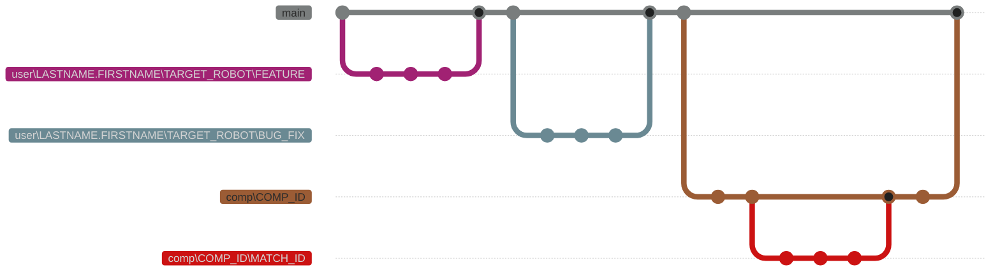

# Git Basics

## Version Control
- ThunderChickens use Git for version control.
- Cloud based repositiories are stored via GitHub.
- branch naming `user\LASTNAME.FIRSTNAME\TARGET_ROBOT\DESCRIPTION`.
- Always create a new branch or work off an existing branch you have permision to work on. If a branch does not have your name in it, check with the author prior to pushing changes.
- No one is allowed to push code changes directly to the `main` branch. While the department lead & mentors have the permissions in GitHub this is only to be used in rare & exceptional cases.
- If creating a folder without defined content, include a `.gitkeep` file so that it can be tracked by git.

*Figure 1:* Example Git branching with ThunderChickens branch naming applied. 



## Remove Local & Global Branches on VSC

(That have been deleted globally)
1. Open a new `Git Bash` terminal
2. Run this command: ```git fetch --prune```
3. Run this command: ```git branch -vv | grep ': gone]' | sed 's/^[* ]*//' | awk '{print $1}' | xargs -r git branch -D```

⚠️ If you do not have `grep`, run the commands below in a **POWERSHELL** terminal with **administrator**
```
winget install --id Git.Git -e --source winget

$PATH = [Environment]::GetEnvironmentVariable("PATH", "Machine"); [Environment]::SetEnvironmentVariable("PATH", "$PATH;C:\Program Files\Git\usr\bin", "Machine")
```