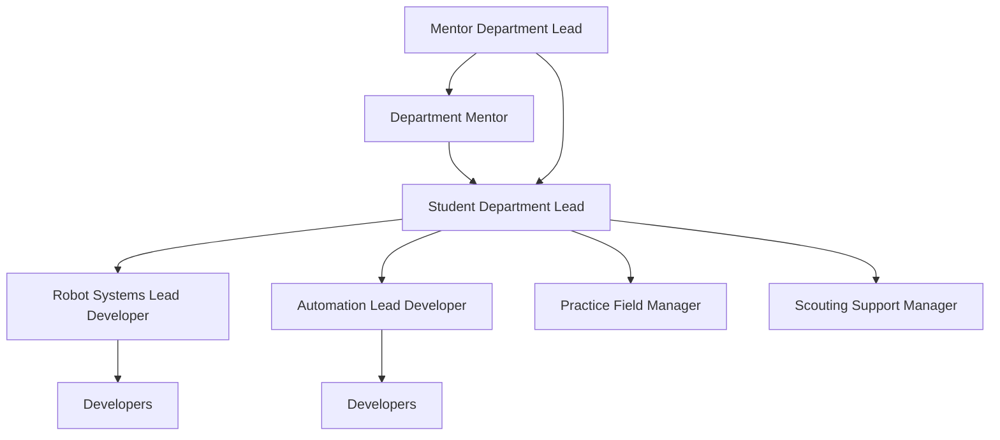

# Programming Department Roles

[TOC]

The purpose of this document is to outline the leadership structure of the programming department. A good structure is critical to the success of any department/team. As the scope and complexity of the work done by the department increases the need for a more defined structure is required. This is a living document. At the end each season the department leadership and students in the department will reflect on how the department functioned and modify it as needed.

## Organization Chart

Outlined below is a brief overview of the roles within the programming department. The goal of this structure is to allow the department to run more effectively as we grow in the technical scope of the department. Year over year the department writes more sophisticated programs to support the needs of the robot and team. With this increase in development work organization of tasks and responsibilities is critical to being successful.

The management of the department is handled by the Mentor Lead and the Student lead. Each lead handles different aspects of the management of the department. The mentor leads job is focused on the long-term direction of the department and the training of the students in the department. The student lead is focused on the development tasks related to the current FRC season and the time management of those tasks.

Lead Developers are the next layer of management within the department. The Lead Developers manage a subset of the overall development. Working with the developers under them they become the first layer of support for the developers under their direction. The intent of the lead developer roles is to take students that are subject matter experts in their pathway and empower them to lead that development effort and support the other student developers.

In addition to the core management of the department there are a couple of specialized roles within the department. They are focused development or management tasks that are larger than the robot development itself. These roles are intended to be supplementary to the student’s primary role, so anyone can serve in these roles. Currently there are two of these specializations. Practice Field Manager and Scouting Support Manager.

The practice field is a critical tool to the success of the department, as such the department take some ownership of the practice field. The role of Practice Field Manager is to help ensure the practice field is functional and support operations related to the practice field.

The Scouting Support Manager works with the strategy department to manage the technical needs of the scouters. This could be modification to scouting apps, supporting laptops & tablets for competition, or assisting in the development of scouting data analysis tools (scripts, macros, spreadsheets). Below you will find a more detailed breakdown of each role within the programming department.

## Mentor Roles

### Department Lead Mentor
**Reports to Lead Mentor.**
**Filled by: Mentor.**

The Department Lead Mentor is the mentor responsible for the department. This mentor is focused on the long-term direction and success of the department. They work with other department leadership to plan, guide and execute the robot and season. Within the department, the Lead Mentor works with the department leadership to help identify the goals and tasks required for a successful season. Training and documentation are core components of the role, ensuring each student can be successful in the department.

- Train and equip the students in the department with the tools needed to be successful within the department.
- Focus on the long-term direction of the department. (Technology to investigate, development projects, etc.).
- Identify the high-level development goals for the season. (Code strategy, core components).
- Mentor the student leadership to ensure their continued growth and success in the department.

### Department Mentor
**Reports to: Department Lead Mentor.**
**Filled by: Mentor.**

The Department Mentors are Mentors within the team that are knowledgeable in the programming concepts and able to help support the students in their development efforts. These mentors work to support the student leadership to ensure they can complete their development tasks. Help in training the students to equip them with the tools they need to be successful.

- Support the needs of the department.
- Investigate new technology, tools, etc. that would go to improving the teams performance or work.
- Train and equip the students in the department with the tools needed to be successful within the department.

## Student Roles

Below outlines the roles students can hold within the department. If an insufficient number of students are in the department to fill all the roles, students can fill multiple roles. Seniors will be prioritized in management roles.

### Department Lead Student
**Reports to: Mentor Lead.**
**Filled by: Student. Prioritizing senior applicants.**

The Department Lead is the student that runs the department. They work with the Student Leadership Team to guide the direction of the robot for the season. From their work with the Student Leadership Team and the department Lead Mentor they set out the development goals for the season. These goals are then broken into a series of tasks created in conjunction with the lead developers. The department lead tracks the progress of the development and communicates to leadership progress, problems and other critical information. This role is more management than programming, expect to write less code and be in more meetings.

- Track development tasks against the timeline to ensure delivery of code by critical deadlines.
- Define development tasks in conjunction with the lead developers.
- Identify subsystems needed for the robot.
- Define Autonomous objectives for the robot to complete.
- Manage the documentation efforts of the department.

### Robot Systems Lead Developer
**Reports to Department Lead.**
**Filled by: Student. Prioritizing senior applicants.**

The Robot Systems Lead Developer is focused on the development of the core robot functionality. This starts with the defining of the subsystems, any subsystem interactions, and the sensor needs of the core systems. This person works with the developers under them to complete all the development work. Lead developers meet with the Department Lead to update them on progress and tasks. This role is a heavy development role with some management work. Students in the role should expect to do mostly development work and help and support developers under them with their programming problems.

- Lead the development and execution of the core robot code.
- Assign development tasks to the developers.
- Identification and implementation of sensor needs for the robots subsystem functions.
  - Encoders, limit switches, Banner sensors, etc.
- Define subsystem interactions / state machine for robot.
- Development of any supporting utilities, commands, and triggers.
- PID tuning and system characterization of the robot components.

### Automation Lead Developer
**Reports to Department Lead.**
**Filled by: Student. Prioritizing senior applicants.**

The Automation Lead Developer works on the advanced automation functionality of the robot. The largest part of this role is developing the various autonomous strategies to use in matches. Any advanced control that happens in the autonomous or teleoperated period also fall under this role. Things like the use of cameras, automated commands for scoring, target tracking, etc. This role is a heavy development role with some management work. Students in the role should expect to do mostly development work and help and support developers under them with their programming problems.

- Lead the development and execution of the autonomous functions of the robot.
- Assign development tasks to the developers.
- Identification and implementation of sensor needs for the robots autonomous functions.
  - Cameras, Lidar, Banner sensors, etc.
- Development of advanced commands that allow the robot to execute autonomously.
- Execute autonomous strategies for both the autonomous and teleoperated periods of the match. (Path Planning, commands, vision, etc.)

### Developer
**Reports to Lead Developer.**
**Filled by: Student.**

The role of the Developer is to complete the development tasks set out by the department. Developers have a choice of what development path they want to focus on and are free to bounce between different tasks. Beyond the development work Developers will be knowledgeable in the various software tools used by the department to test, configure, debug and support the robot. This role is pure development, so students should expect to spend most of their time writing, testing, and documenting code.

- Complete basic training in how to use the software tools of the department.
- Write code to support the development tasks of the department.
- Test robot code via simulation and on the robot hardware.
- Generate documentation for the engineering notebook related to the task performed within the department.

### Practice Field Manager
**Reports to Department Lead.**
**Filled by: Student.**

The Practice Field Manager is the student that is responsible for the Field Management System for our practice field. They will be responsible for training students on how to run the field and supporting any technical issues with the field. The practice field will have AprilTags on the field for robot positioning, it is the responsibility of the practice field manager to ensure the AprilTags remain in the correct positions and in good condition. In addition to the field itself the Practice Field Manager will be responsible for the fleet of robots under the departments control, ensuring that the latest code is deployed to each and that they remain in good working order. 

- Support the Strategy department and the drive team with technical support.
- Know how to operate and troubleshoot the Field Management System (FMS).
- Responsible for the training of students in the operation of the FMS & DriverStation.
- Maintain the available robots for practice use. (Past comp robots, development chassis, etc.).

### Scouting Support Manager
**Reports to Department Lead.**
**Filled by: Student.**

The Scouting Support Manager handles development tasks related to scouting. The selection, maintenance, and deployment of a scouting system is the primary responsibility of the Scouting Support Manager. This work happens in conjunction with the scouting team in the Strategy Department. Beyond that data analysis tools, technology support and needs are handled by this student and communicated to leadership. As the team gets more involved in scouting the technical needs of the group have increased and this role serves as a way for us to better monitor and handle those needs.

- Support the Strategy Department scouters with technical support.
- Select, develop, maintain and deploy a scouting system in conjunction with the Strategy Department.
- Identify technical needs of the Strategy Department.
- Work with the Strategy Department to develop data analytics tools to better understand and interpret scouting data collected at competitions.
- Archive the data collected for future reference.

## Revision History

| Date       | Rev  | Description             | Author |
| ---------- | ---- | ----------------------- | ------ |
| 07/25/2024 | 1.0  | Initial Release         | AK     |
| 08/30/2026 | 1.1  | Conversion to Markdown  | AK     |