# Vision Resources

## Contents
- [Sensor Models:](#sensor-models)
  - [OV9281](#ov9281)
  - [OV9782](#ov9782)
  - [AR0135CS](#ar0135cs)
- [Camera Models:](#camera-models)
  - [ArduCam B0332 | OV9281 ~$50](#arducam-b0332-ov9281-~50)
  - [InnoMaker U20CAM-9281M | OV9281 ~$30](#innomaker-u20cam-9281m-ov9281-~30)
  - [ArduCam B0385 | OV9782 ~$60](#arducam-b0385-ov9782-~60)
  - [Allied Vision Alvium 1800 U-120c](#allied-vision-alvium-1800-u-120c)
- [ArduCam Lens Options](#arducam-lens-options)
  - [M2016ZH01: 10° FOV on PiCam](#m2016zh01-10-fov-on-picam)
  - [M2508ZH02: 26° FOV on PiCam](#m2508zh02-26-fov-on-picam)
  - [M2506ZH04: 33° FOV on PiCam](#m2506zh04-33-fov-on-picam)
  - [M25360H06: 67° FOV on PiCam](#m25360h06-67-fov-on-picam)
  - [M27210H08: 73° FOV on PiCam](#m27210h08-73-fov-on-picam)
  - [M40180H13L: 110° FOV on PiCam](#m40180h13l-110-fov-on-picam)
  - [M25170H12: 118° FOV on PiCam](#m25170h12-118-fov-on-picam)
  - [M25156H14: 141° FOV on PiCam](#m25156h14-141-fov-on-picam)
  - [M30171H16: 180° FOV on PiCam](#m30171h16-180-fov-on-picam)
  - [M32076M20: 220° FOV on PiCam](#m32076m20-220-fov-on-picam)

## Sensor Models:
### OV9281
- Image Color: Monochrome (Black & White)
- Shutter Mode: Global Shutter
- Resolution: 1 Megapixel (720p)
- Frame Rate: 100 Frames per second
- Use Case: AprilTag Detection

### OV9782
- Image Color: Color
- Shutter Mode: Global Shutter
- Resolution: 1 Megapixel (720p)
- Frame Rate: 100 Frames per second
- Use Case: Object Detection

### AR0135CS
- Image Color: Color
- Shutter Mode: Global Shutter
- Resolution: 1.2 Megapixel (960p)
- Frame Rate: 52 Frames per second
- Use Case: Object Detection

## Camera Models:
### [ArduCam B0332](https://www.arducam.com/arducam-120fps-global-shutter-usb-camera-board-1mp-720p-ov9281-uvc-webcam-module-with-low-distortion-m12-lens-without-microphones-for-computer-laptop-android-device-and-raspberry-pi.html) | OV9281 ~$50

<!-- 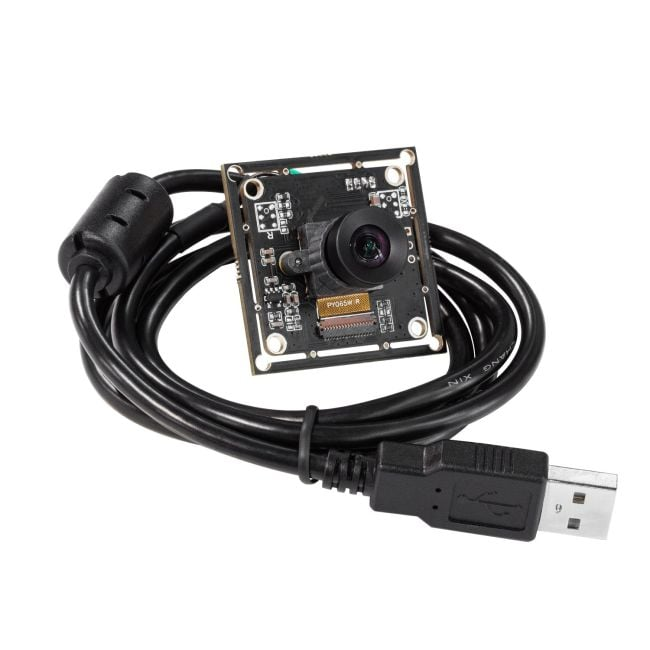 -->

- Field of View (FOV): 70 degrees (H)
- Lens Mount: M12

### [InnoMaker U20CAM-9281M](https://www.inno-maker.com/product/u20cam-9281m/) | OV9281 ~$30

<!-- 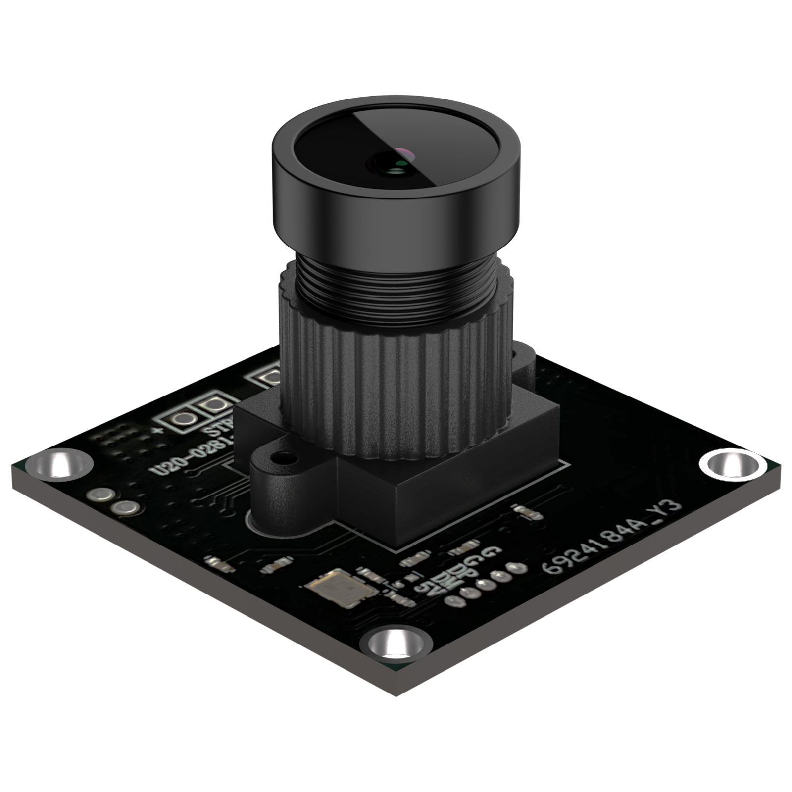 -->

- Field of View (FOV): 140 degrees (H)
- Lens Mount: M12

### [ArduCam B0385](https://www.arducam.com/100fps-global-shutter-color-usb-camera-board-1mp-ov9782-uvc-webcam-module-with-low-distortion-m12-lens-without-microphones-for-computer-laptop-android-device-and-raspberry-pi-arducam.html) | OV9782 ~$60

<!-- 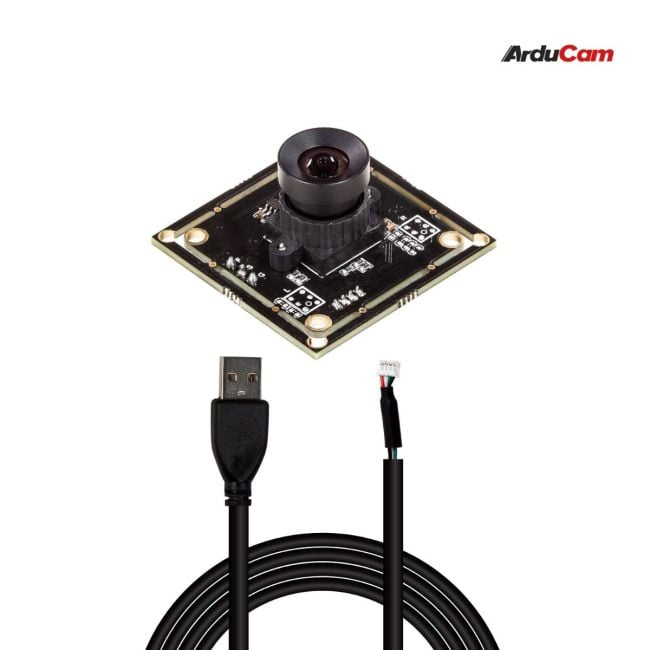 -->

- Field of View (FOV): 70 degrees (H)
- Lens Mount: M12

### [Allied Vision Alvium 1800 U-120c](https://www.edmundoptics.com/p/Allied-Vision-Alvium-1800-U-120c-13-12MP-S-Mount-USB-31-Color-Camera/42978?gad_source=1&gad_campaignid=13119664528&gclid=CjwKCAjwvO7CBhAqEiwA9q2YJXOe8ENJLFAVuRY7BWkGEp8bWYOKhWRI6bgxAd66MUWJMI1muU7UPBoCaXEQAvD_BwE)

<!-- 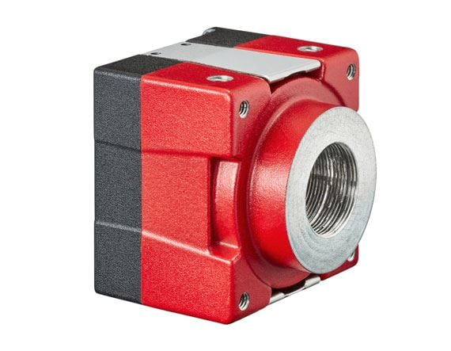 -->

- Field of View (FOV): 70 degrees (H)
- Lens Mount: M12

## ArduCam Lens Options
### [M2016ZH01](https://www.arducam.com/m2016zh01-2.html): 10° FOV on PiCam

<!--  -->

- Optical Format: 1/2"
- EFL(mm): 16
- BFL(mm): 7.1
- F/NO: 2.0
- FOV (D/H/V): 29/23/170
- MOD: 0.3m
- Size(mm): 14x16.2

### [M2508ZH02](https://www.arducam.com/m2508zh02-2.html): 26° FOV on PiCam

<!-- 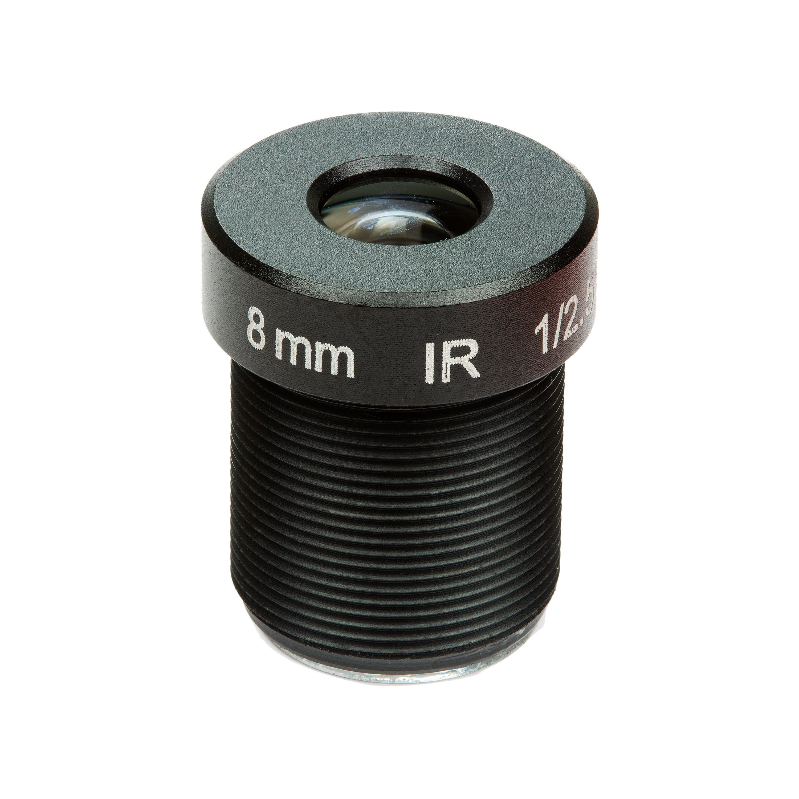 -->

- Optical Format: 1/2.5"
- EFL(mm): 8
- BFL(mm): 8.1
- F/NO: 2.0
- FOV (D/H/V): 50/40/30
- MOD: 0.3m
- Size(mm): 14x16.9

### [M2506ZH04](https://www.arducam.com/m2506zh04-2.html): 33° FOV on PiCam

<!-- 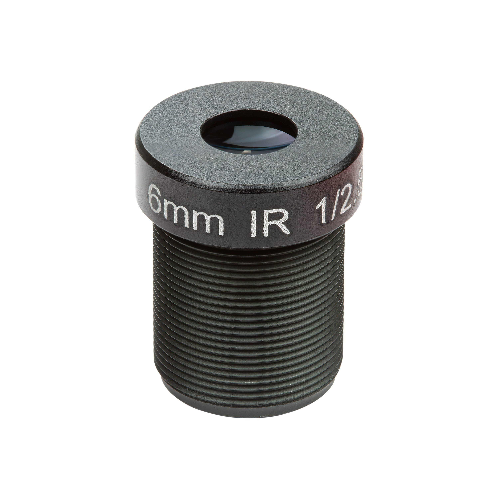 -->

- Optical Format: 1/2.5"
- EFL(mm): 6
- BFL(mm): 7.3
- F/NO: 2.0
- FOV (D/H/V): 67/53/41
- MOD: 0.3m
- Size(mm): 14x17.4

### [M25360H06](https://www.arducam.com/m25360h06-2.html): 67° FOV on PiCam

<!-- 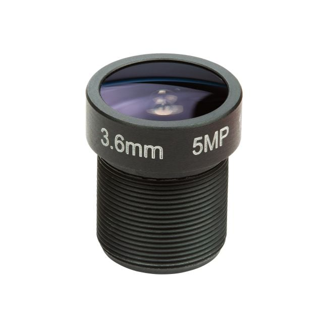 -->

- Optical Format: 1/2.5"
- EFL(mm): 3.6
- BFL(mm): 5
- F/NO: 2.0
- FOV (D/H/V): 156/114/80
- MOD: 0.2m
- Size(mm): 14x16.8

### [M27210H08](https://www.arducam.com/m27210h08-2.html): 73° FOV on PiCam

<!-- 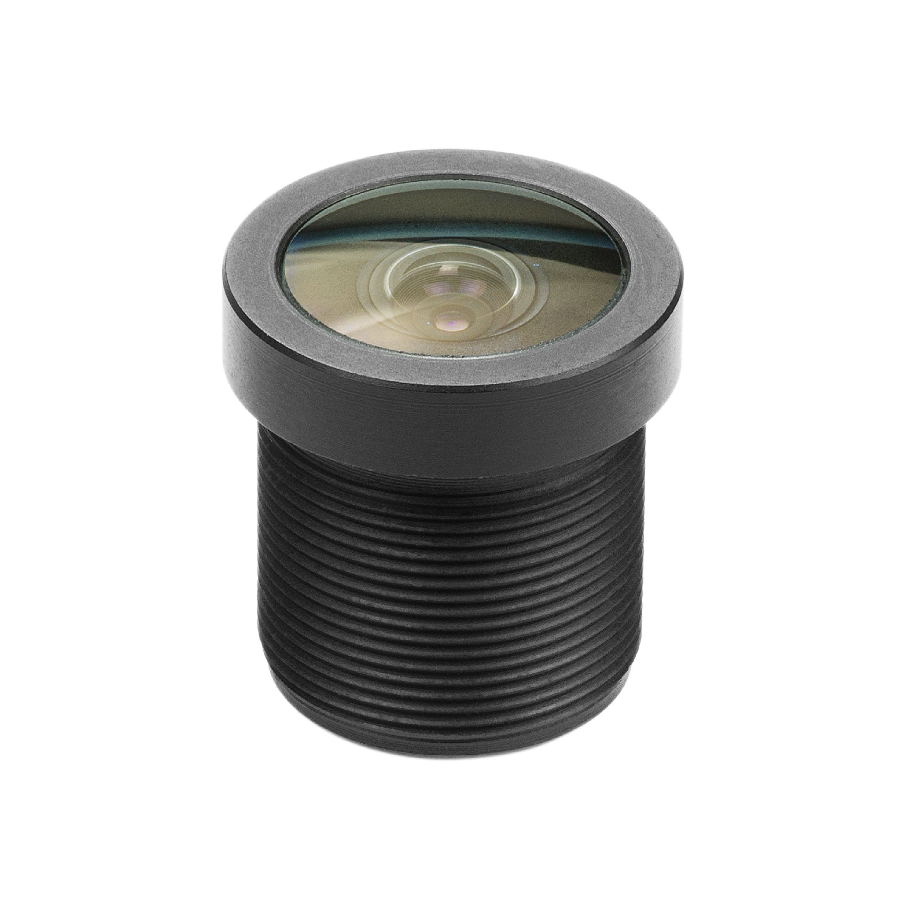 -->

- Optical Format: 1/2.7"
- EFL(mm): 2.1
- BFL(mm): 6.3
- F/NO: 2.0
- FOV (D/H/V): 170/120/80
- MOD: 0.3m
- Size(mm): 14x15.2

### [M40180H13L](https://www.arducam.com/arducam-m12-mount-camera-lens-m40180h13l.html): 110° FOV on PiCam

<!--  -->

- Optical Format: 1/4"
- EFL(mm): 1.8
- BFL(mm): 3
- F/NO: 2.4
- FOV (D/H/V): 122/110/94.5
- MOD: 0.1m
- Size(mm): 14x14.7

### [M25170H12](https://www.arducam.com/m25170h12-2.html): 118° FOV on PiCam

<!-- 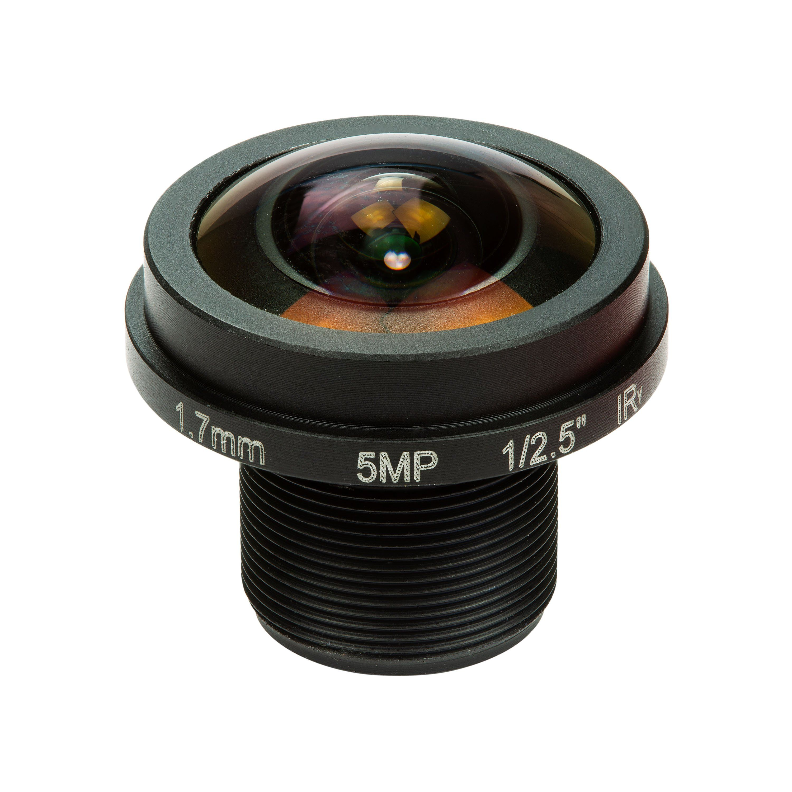 -->

- Optical Format: 1/2.5"
- EFL(mm): 1.7
- BFL(mm): 4.7
- F/NO: 2.0
- FOV (D/H/V): 180/180/140
- MOD: 0.2m
- Size(mm): 20x18.7

### [M25156H14](https://www.arducam.com/m25156h14.html): 141° FOV on PiCam

<!-- 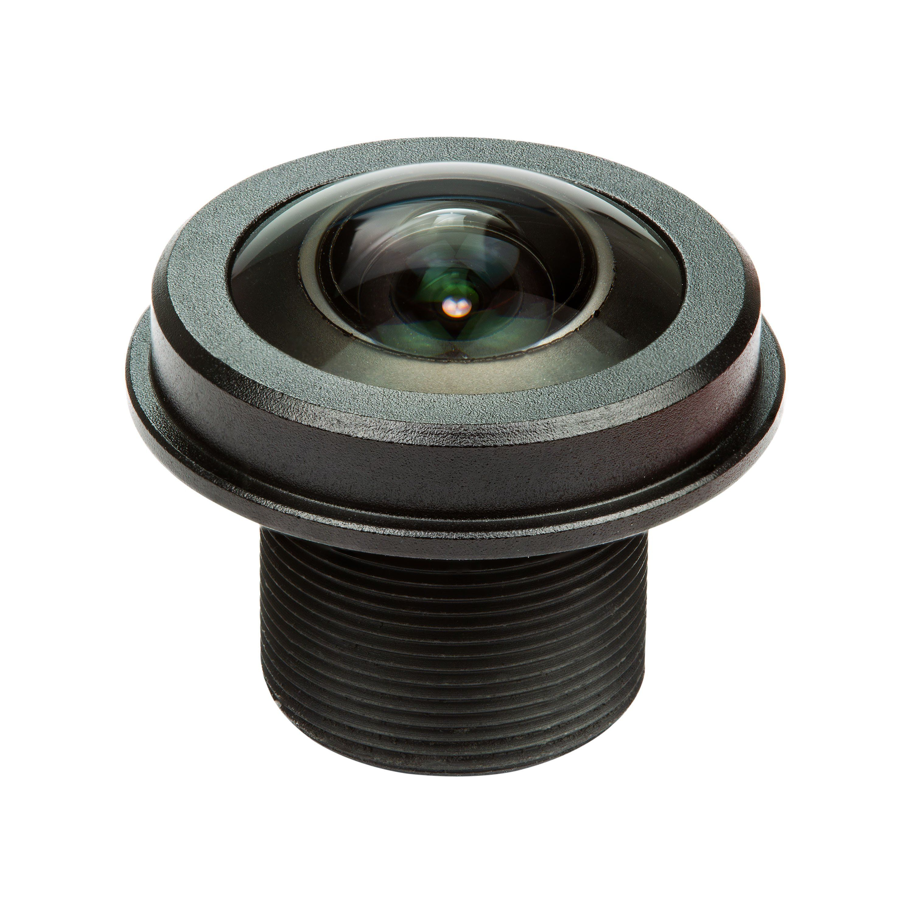 -->

- Optical Format: 1/2.5"
- EFL(mm): 1.56
- BFL(mm): 4.3
- F/NO: 2.0
- FOV (D/H/V): 185/185/140
- MOD: 0.2m
- Size(mm): 20x17.3

### [M30171H16](https://www.arducam.com/m30171h16-2.html): 180° FOV on PiCam

<!-- 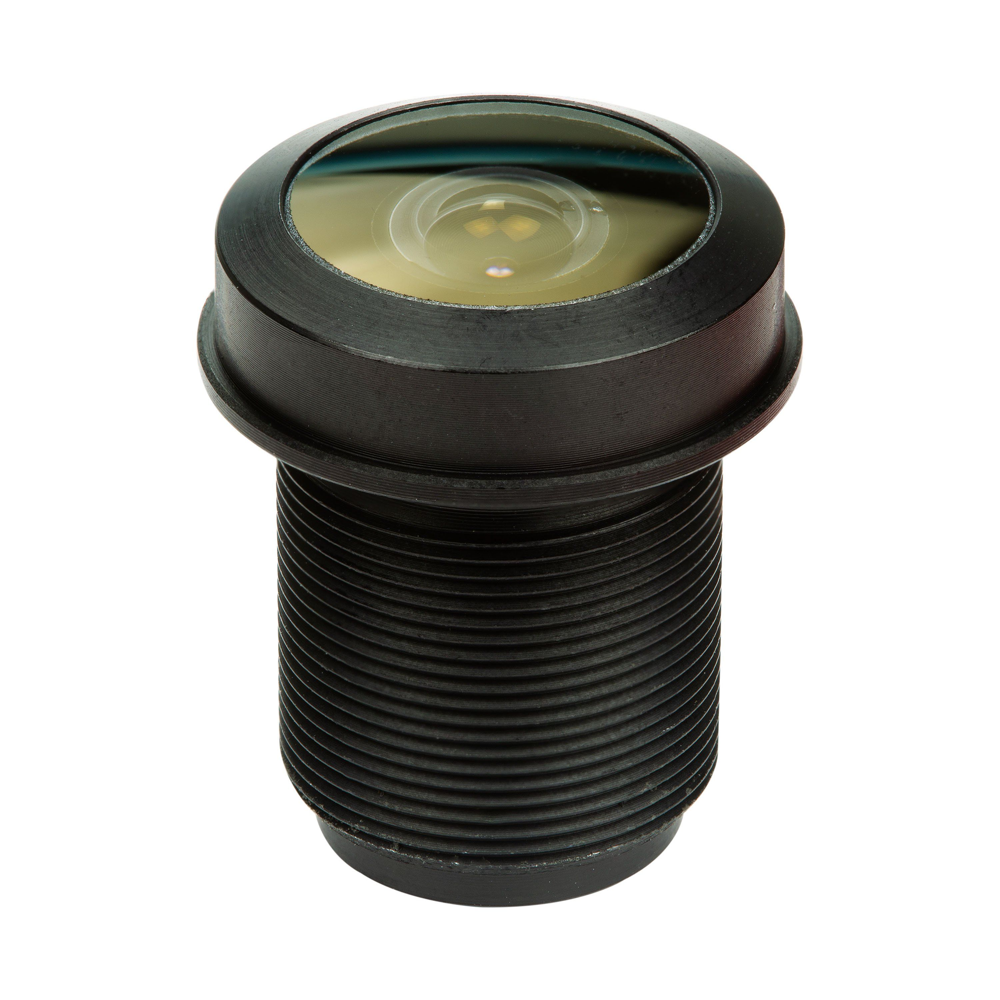 -->

- Optical Format: 1/3"
- EFL(mm): 1.71
- BFL(mm): 4.71
- F/NO: 2.2
- FOV (D/H/V): 184/184/104
- MOD: 0.2m
- Size(mm): 15x19.7

### [M32076M20](https://www.arducam.com/m32076m20-2.html): 220° FOV on PiCam

<!-- 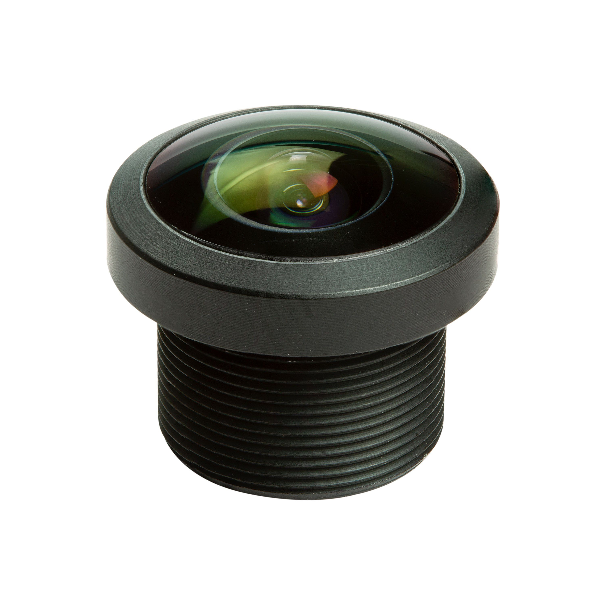 -->

- Optical Format: 1/3.2"
- EFL(mm): 0.76
- BFL(mm): 2
- F/NO: 2.1
- FOV (D/H/V): 222/222/222
- MOD: 0.2m
- Size(mm): 16x13.5
